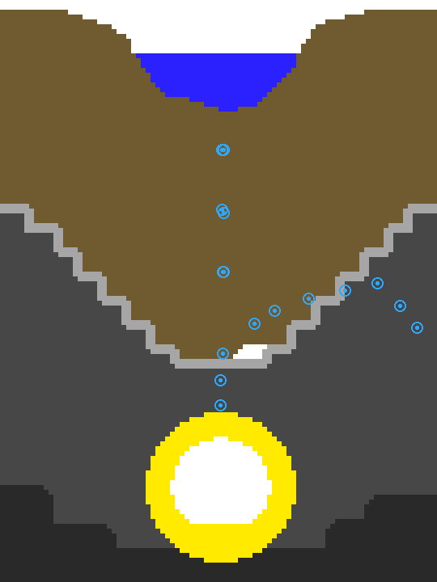

# 💧 Willemilks Water Editor

[](https://github.com/Willemilk/willemilks-water-editor/releases/latest)
[](https://github.com/Willemilk/willemilks-water-editor/releases)
[](LICENSE)
[](https://github.com/Willemilk/willemilks-water-editor/releases/latest)

A modern desktop level editor for **Where's My Water?**, built to do the one thing
[Where's My Editor (WME)](https://github.com/wmw-modding/wheres-my-editor) can't: **edit the terrain.**

Runs as a native Windows app (Electron) with proper File / Edit / View / Help menus, and also
works in any browser. Everything is local. Nothing gets uploaded anywhere.




## Features

**Terrain editing (the headline)**
- Paint terrain directly with Pencil, Line, Rectangle, Fill bucket, Eraser and Material picker
- The official material palette, extracted from the game's own `LevelEditor.psd`:
  Empty, Dirt, Algae, Rock (+ shadow/highlight), Water, Poison, Ooze, Swampy's Room
- Adjustable brush size (1–9 px), pixel-perfect nearest-neighbor zoom up to 40×
- Saves as **8-bit indexed PNG** exactly like the originals (auto-falls back to truecolor if you
  somehow use >256 colors) — verified pixel-perfect against real game levels

**Object editing (everything WME does, and more)**
- Live sprite rendering straight from the game's `.hs → .sprite → .imagelist → .webp` chain,
  with correct rotation, flipping and grid scaling (1 grid unit = 1.25 terrain px, center origin)
- Object browser with thumbnails for all ~345 game objects, grouped by category, searchable
- Click-to-place, drag-to-move (Shift = snap), arrow-key nudging, duplicate (Ctrl+D), delete
- Full property inspector with suggestions from the game's own `_level_properties_doc.txt`
  (Spouts, Motors, Pins, Switches, Bombs, GravityScale, FluidType, timers…)
- **Motor path editing**: drag the numbered waypoints, add/remove points, `PathIsGlobal` aware
- Room marker (Swampy's bathtub position) shown and draggable
- Level-wide properties + a material histogram of the open level

**Levels in real game order**
- The level browser mirrors the in-game progression, read straight from the game's own
  `water.db`: Swampy worlds 1 to 10, Bonus, Secret, then Cranky, Mystery Duck, Allie and the
  Lost Levels packs, each collapsible per world
- Real level titles from the game's localization file ("First Dig" instead of `first_dig`),
  search matches both the title and the filename

**Smart rock painting**
- Painted rock merges with rock that is already in the level instead of sitting on top of it
- The highlight rim regenerates automatically: new top surfaces get the 2 pixel highlight edge,
  buried edges turn back into rock body, hand placed deep shadow stays untouched
  (rule measured on the original levels)
- The fill bucket treats rock, rock shadow and rock highlight as one region
- Toggle it off in the toolbar or the View menu if you want raw pixel control

**Playtest on MuMu or any Android device (desktop app)**
- One button (or F5): the editor rebuilds the APK with your edits baked in, signs it with
  uber-apk-signer, installs it over adb and launches the game on your emulator
- Works with MuMu out of the box (default device address 127.0.0.1:16384), or any adb device
- The rebuild keeps every byte of the original APK except your changes, strips the old
  signature and keeps resources.arsc uncompressed, which is what prevents the native crash
- Setup once in Settings: the path to uber-apk-signer.jar and adb. Java must be installed.

**Spout quick editor**
- Select any spout or drain and get friendly dropdowns instead of raw properties:
  behavior (always running, starts when touched, drain, drain and spout), fluid
  (water, poison water, ooze), flow rate, particle limit and a simple on/off interval timer
- It writes the exact properties the game reads (SpoutType, FluidType, Timer0/1 and friends)

**Four languages**
- English, Nederlands, Español and 中文, switchable in Settings

**Quality of life**
- Snapshot **undo/redo for everything**, terrain strokes and object edits alike (Ctrl+Z / Ctrl+Y)
- Reopen your last game files with one click (desktop app), unsaved-changes guards everywhere
- Alt+click with any paint tool picks the material under the cursor, Esc deselects,
  zoom percentage in the status bar, preferences (language, smart terrain) persist
- Grid overlay, collision-shape overlay, fit-to-view, keyboard shortcuts for every tool
- Skippable interactive tutorial on first launch (re-open it anytime with the **?** button)
- Create brand-new empty levels from scratch
- Export: single level as zip, `.xml` only, `.png` only, or the **entire modified `assets/` tree** as
  one zip ready for repacking

## Download

Grab the latest Windows build from the
**[Releases page](https://github.com/Willemilk/willemilks-water-editor/releases/latest)**:

- **`WillemilksWaterEditor-Setup-x.y.z.exe`** — installer (Start menu + desktop shortcut, per-user, no admin needed)
- **`WillemilksWaterEditor-Portable-x.y.z.exe`** — single file, run it anywhere, nothing installed

Windows SmartScreen may show an "unknown publisher" warning the first time (the build isn't
code-signed) — click *More info → Run anyway*.

Releases are built automatically by GitHub Actions whenever a `v*` tag is pushed; see
[`.github/workflows/release.yml`](.github/workflows/release.yml).

## Getting started

**Desktop app**

```bash
npm install
npm run app      # build + launch the desktop app
npm run dist     # produce the Windows installer + portable exe in release/
```

`npm run dist` needs to run on Windows (it downloads the Electron runtime on first install).
The result lands in `release/`: an NSIS installer and a portable single exe.

**Browser version**

```bash
npm run dev      # → http://localhost:5173
```

Then drop one of these onto the welcome screen:
- your `base.apk` (`com.disney.WMW`)
- a zip that *contains* the apk (nested archives are unpacked automatically)
- or pick the extracted game folder (the one containing `assets/`)

Pick a level (try `first_dig`), paint, place objects, save.

> Everything stays in your browser's memory. **Save** writes into the loaded virtual game tree;
> **Export** downloads files to disk. Nothing is uploaded anywhere.

## Getting your edits into the game

The editor produces a game-compatible `levelname.xml` + `levelname.png` pair (or a full
`assets/` zip). Repack with the usual workflow:

1. Export your level (or the whole assets zip)
2. Copy the files over the originals in your unpacked APK folder (`assets/Levels/`)
3. Rebuild + sign + install — e.g. the `mod.bat` flow:
   7-Zip repack (deflate, `resources.arsc` stored uncompressed) → `uber-apk-signer` → `adb install`
4. Hard rules the editor already enforces for you: keep the PNG dimensions identical to the
   original and stick to the official material colors — that's what prevents the native segfault

## Tech

Vite + vanilla ES modules, zero framework. [`fflate`](https://github.com/101arrowz/fflate) for
zip/apk reading and writing, browser-native WebP decoding for sprite atlases, HTML canvas for
rendering, and a tiny hand-rolled indexed-PNG encoder (CRC32 + zlib via fflate).

```
src/
  core/   vfs (zip/apk → virtual fs) · level (XML + undo) · terrain (paint ops)
          objects (.hs/.sprite/.imagelist resolver) · png (indexed encoder) · coords · export
  ui/     editor (canvas, tools, input) · panels (browsers + inspector) · tutorial
  data/   materials (official palette)
```

Format knowledge is based on the community work of
[wmw-modding](https://github.com/wmw-modding) (WME & wmwpy) plus direct analysis of the game
files — the developer-left `LevelEditor.psd` and `_level_properties_doc.txt` were gold.

## Build

```bash
npm run build    # → dist/ (static, host anywhere: Vercel, GitHub Pages…)
```

## License

MIT — see [LICENSE](LICENSE). Game assets are © Disney; bring your own legally obtained copy.

## Credits

This editor stands on the shoulders of the Where's My Water modding community:

- **[Where's My Editor (WME)](https://github.com/wmw-modding/wheres-my-editor)** and
  **[wmwpy](https://github.com/wmw-modding/wmwpy)** by the wmw-modding team (GPL-3.0).
  Their reverse engineering of the level format, the object/sprite chain and the
  1.25 coordinate multiplier made this project possible. Willemilks Water Editor is an
  independent implementation written from scratch, but the format knowledge traces back
  to their work. Go star their repos.
- The original **Where's My Water?** is © Disney. This editor does not include or
  distribute any game assets; you load your own legally obtained copy of the game.

## Legal notes (not legal advice)

- The editor's own code is original and MIT licensed, so you can release it.
- Never bundle or share the game's APK, levels, sprites or audio with the editor.
- Don't use Disney logos or imply Disney endorses this. Naming the game for
  compatibility ("a level editor for Where's My Water") is how the modding scene
  normally does it.
